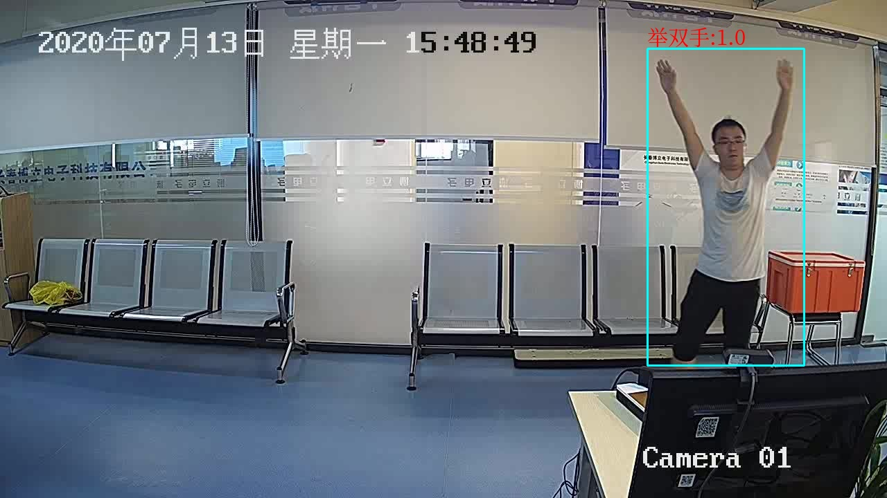
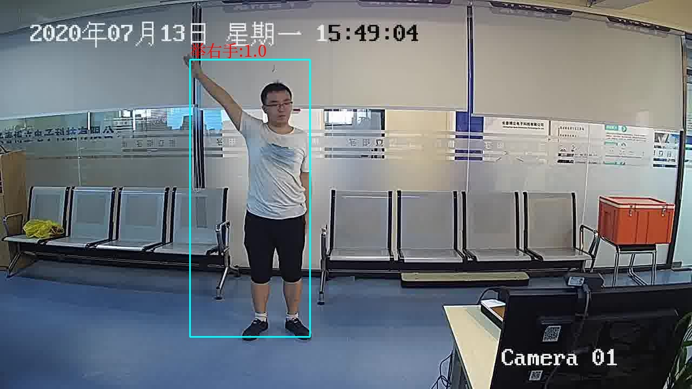
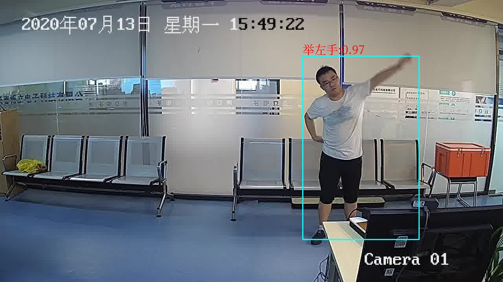
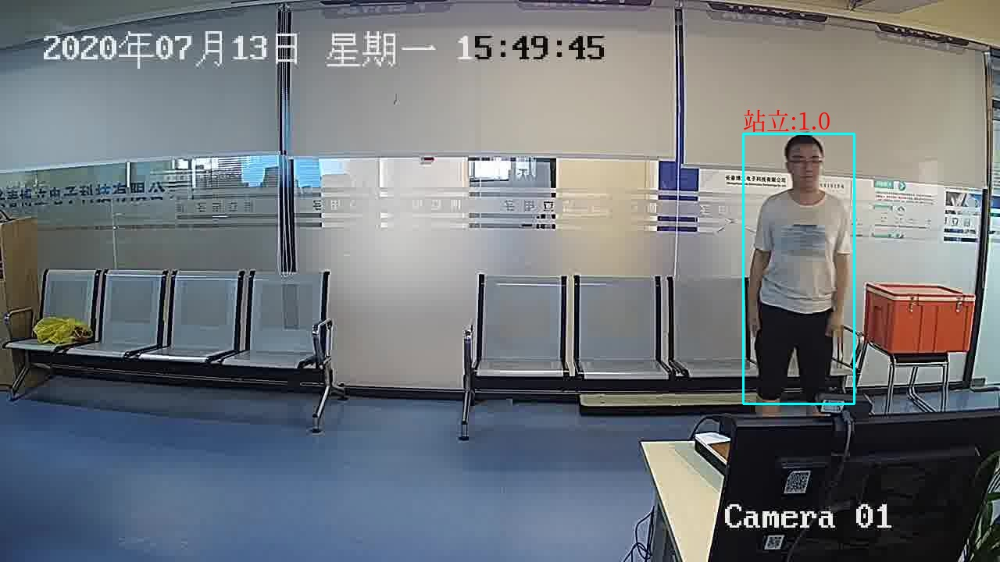
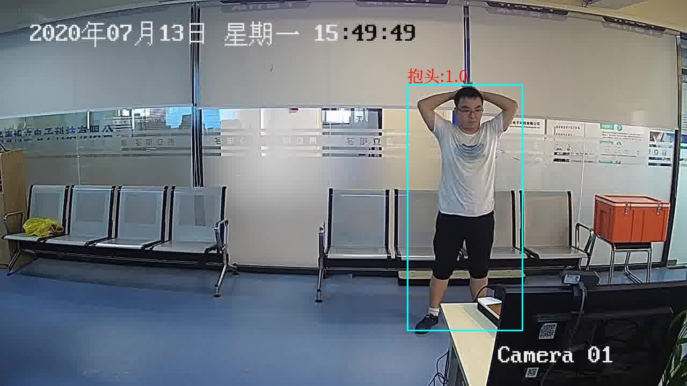
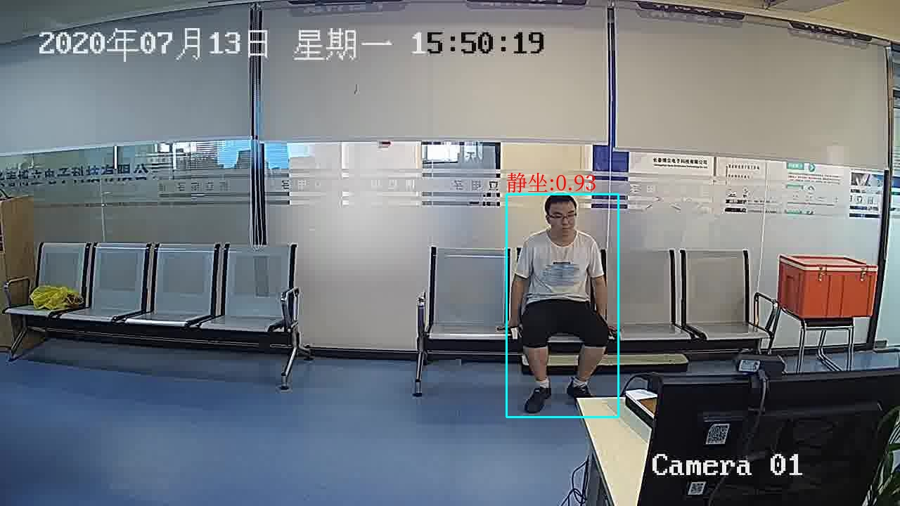

#  POSE_DETECT

## 介绍
对人体的一些动作进行区分

## 效果图
<!-- 




 -->

<div align="left">
    
    
    
</div>
<div align="left">
    
    
    
</div>


## 使用方法(基于docker环境)

使用build环境进行编译部分必须库(dev环境的docker体积较大)
```
run.sh build 
```

使用runtime环境运行检测功能(runtime-docker镜像体积更小)
```
run.sh run
```


## 环境安装，与alphapose项目基本一致

参考[alphapose项目](README_alphapose.md)


## 必要下载文件

中文字体文件，用于opencv绘制中文字体
[NotoSerifCJK-Regular.ttc](https://github.com/googlefonts/noto-cjk/blob/master/NotoSerifCJK-Regular.ttc) 


动作检测模型下载，放置于models目录下面
```
链接: https://pan.baidu.com/s/1hE0faRd-JCPH3P-hdEw8LQ
提取码: 98f9
```


